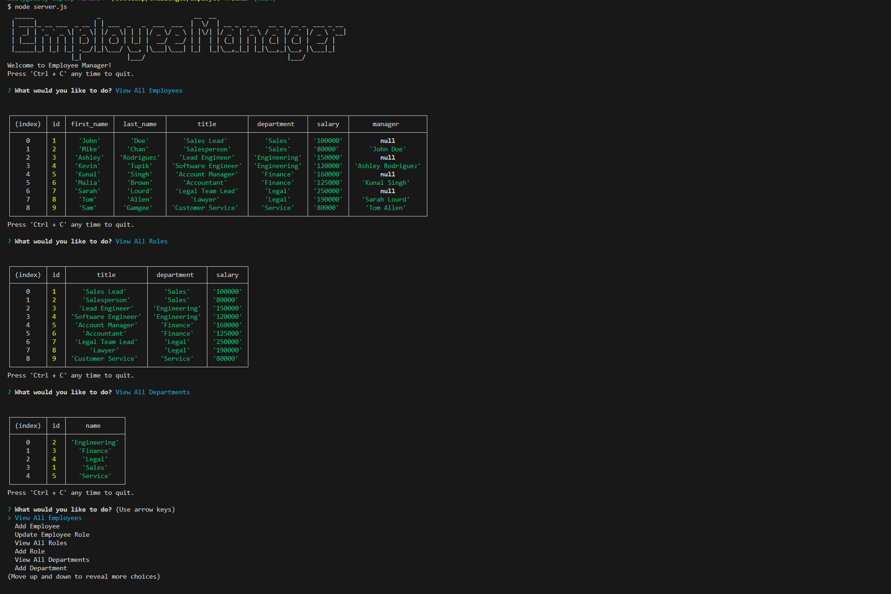

# Employee-Tracker

EdX Coding Bootcamp - Module 12 - SQL Challenge

## Table of Contents

- [Description](#description)
- [Installation](#installation)
- [Usage](#usage)
- [Screenshot](#screenshot)
- [License](#license)
- [Contributors](#contributors)
- [Test](#test)
- [Questions](#questions)

## Description

An emplyee management node server application connected to a SQL database that allows the user to track and update department, employees, and roles within their company.

## Installation

- NodeJS - [v16.18.0](https://nodejs.org/dist/v16.18.0/node-v16.18.0-x64.msi) recommended
- See [package.json](/package.json) for dependencies.

## Usage

In the Terminal, navigate to the containing folder and enter "node index.js" to run the Employee-Tracker.

Select an option from the menu and follow the prompts to view, update, or remove records.

## Screenshot

## License

MIT License
See [LICENSE](/LICENSE) file in contatining directory

## Contributors

Used the references and tutorials from:

- Multiple activities from 12-SQL class lessons and files.
- Multiple activities from 09-NodeJS class lessons and files.
- [The MySQL Documentation](https://dev.mysql.com/doc/)
- [Figlet](https://www.npmjs.com/package/figlet): for the splash ASCII text art
- [MDN Web Docs](https://developer.mozilla.org/en-US/docs/Web/JavaScript)
- [W3 Schools](https://www.w3schools.com/mysql/default.asp)

## Test

N/A

## Questions?

[Employee-Tracker GitHub Repository](https://github.com/dustybrigsby/Employee-Tracker)

If not found there, you can email me at:

[dustybrigsby@gmail.com](mailto:dustybrigsby@gmail.com)
